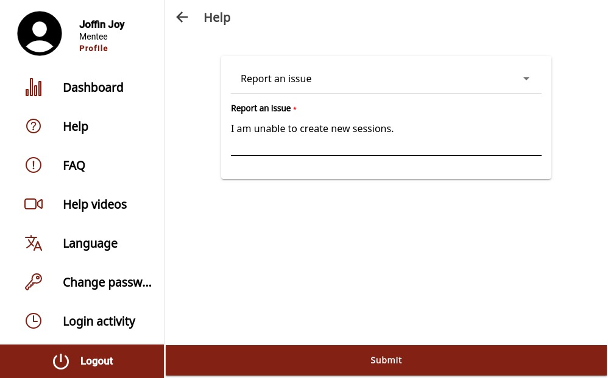

# MentorEd Environment Variable Modification Guide

## Overview

The existing MentorEd documentation and setup guides include a set of environment files with default environment variables. These serve as an excellent starting point for any deployment and offer a fully operational MentorEd application for you to explore. However, as expected, certain features may be impaired without replacing the default environment variables with adopter-specific values. For example, variables related to notification email services and cloud file upload.

This document acts as a reference for such functionalities/features and their related environment variables.

## Affected Features

1. **User SignUp**

    Since an email with an OTP code is sent to verify the email ID provided during the signup process, the notification service environment variables must be configured with real values sourced from an email service. Currently, MentorEd's notification service natively supports Sendgrid as the default email service. Therefore, the following environment variables must be set for this feature to function properly.

    ### Notification Service

    **Docker Setup:** `notification_env`

    **Manual Setup:** `notification/src/.env`

    **Variables:**

    ```
    SENDGRID_API_KEY
    SENDGRID_FROM_EMAIL
    ```

    > **Note:** If the **APPLICATION_ENV** in the user service is set to "**development**," the OTP code will be logged in the console. This feature might be advantageous in a local setup as it bypasses the need for a Sendgrid account. Logging is disabled in production environments (**APPLICATION_ENV=production**).

    ### Relevant Resources

    1. [Twilio SendGrid](https://sendgrid.com/en-us)

2. **File Upload**

    MentorEd utilises file upload functionality to implement several features like profile and session image upload, bulk user creation and bulk session creation. Therefore it is expected that you have a bucket configured with a cloud provider of your choosing (AWS, GCP, AZURE or OCI). And relevant environment fields are set in the following services.

    ### Mentoring & User Services

    **Docker Setup:** `mentoring_env`, `user_env`

    **Manual Setup:** `mentoring/src/.env`, `user/src/.env`

    **Variables:**

    ```
    CLOUD_STORAGE			->Choice of cloud provider (AWS, GCP, AZURE, OCI)

    ============AWS============
    AWS_ACCESS_KEY_ID
    AWS_SECRET_ACCESS_KEY
    AWS_BUCKET_REGION
    AWS_BUCKET_ENDPOINT
    DEFAULT_AWS_BUCKET_NAME

    ============GCP============
    GCP_PATH
    DEFAULT_GCP_BUCKET_NAME
    GCP_PROJECT_ID

    ===========AZURE===========
    AZURE_ACCOUNT_NAME
    AZURE_ACCOUNT_KEY
    DEFAULT_AZURE_CONTAINER_NAME

    ============OCI============
    OCI_ACCESS_KEY_ID
    OCI_SECRET_ACCESS_KEY
    OCI_BUCKET_REGION
    OCI_BUCKET_ENDPOINT
    DEFAULT_OCI_BUCKET_NAME
    ```

    ### Relevant Resources

    1. [Create AWS S3 Bucket](https://docs.aws.amazon.com/AmazonS3/latest/userguide/create-bucket-overview.html)
    2. [Create GCP Bucket](https://cloud.google.com/storage/docs/creating-buckets)
    3. [Create Azure Blob Storage](https://learn.microsoft.com/en-us/azure/storage/blobs/storage-quickstart-blobs-portal)
    4. [Create OCI Object Storage Bucket](https://docs.oracle.com/en-us/iaas/Content/Object/Tasks/managingbuckets_topic-To_create_a_bucket.htm)

3. **Support Emails**

    MentorEd provides a mechanism for users to generate request emails that are sent to a support team overseeing user requests. For example, if a user wants to delete their account or report an issue, they can trigger an email with their request message from the portal.

    <div style="text-align: left; width: 100%;">
        <h4 style="text-align: left;">MentorEd Report Issue Help Page</h4>
        
    </div>

    For this feature to function, support email IDs and other values must be set in the mentoring service as listed below.

    ### Mentoring Service

    **Docker Setup:** `mentoring_env`

    **Manual Setup:** `mentoring/src/.env`

    **Variables:**

    ```
    SUPPORT_EMAIL_ID
    ENABLE_EMAIL_FOR_REPORT_ISSUE			-> Already enabled in default/sample env files
    ```

    > **IMPORTANT:** As a prerequisite, the notification service must be configured with the proper SendGrid environment variables, as shown in the User SignUp section.
